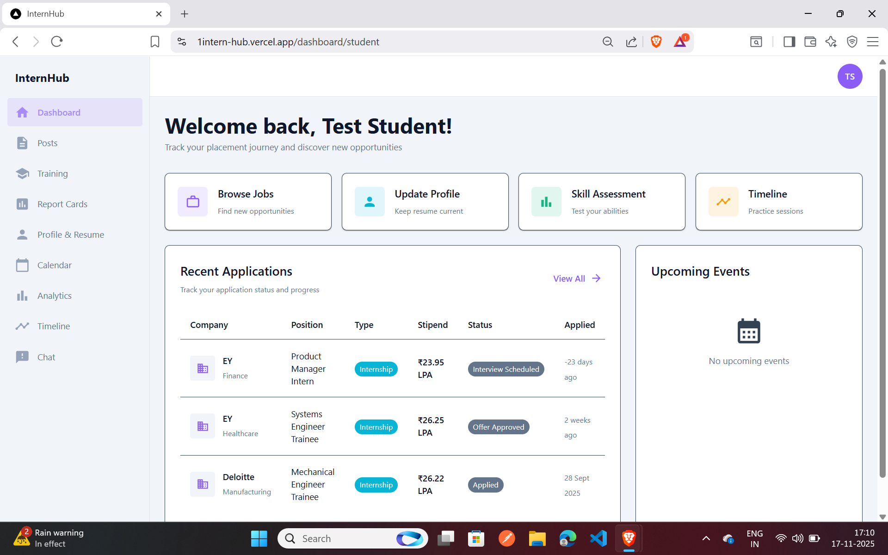
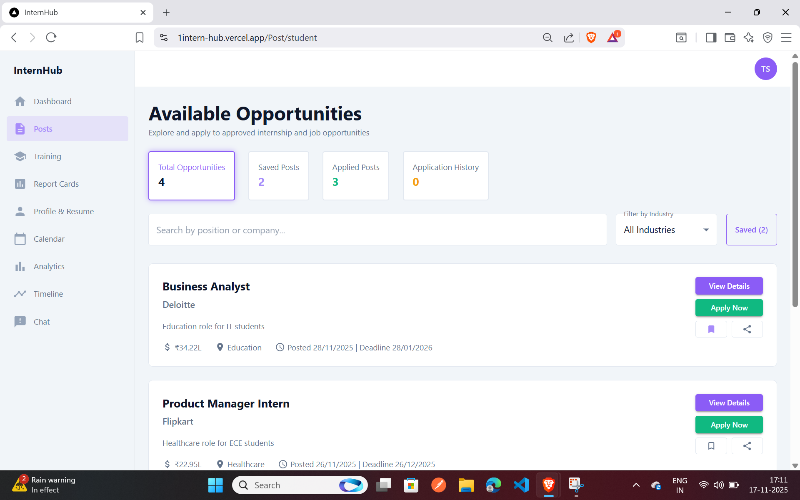
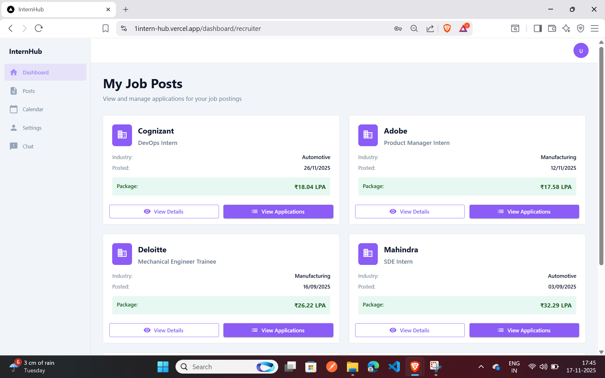
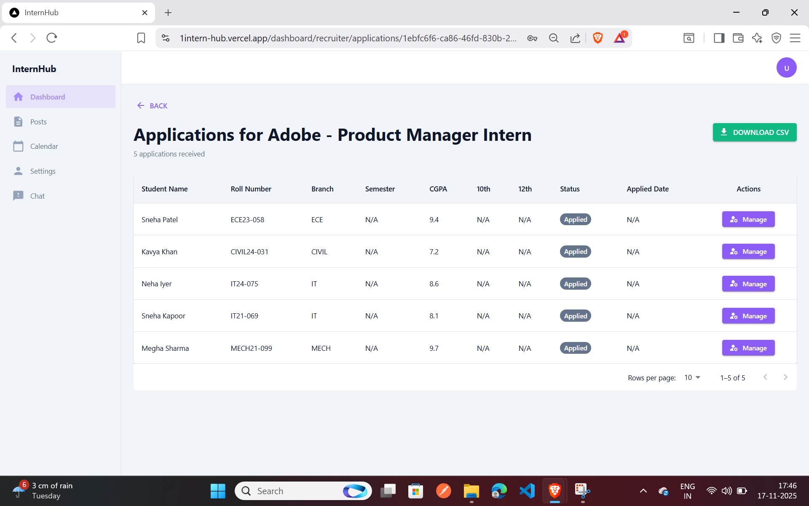
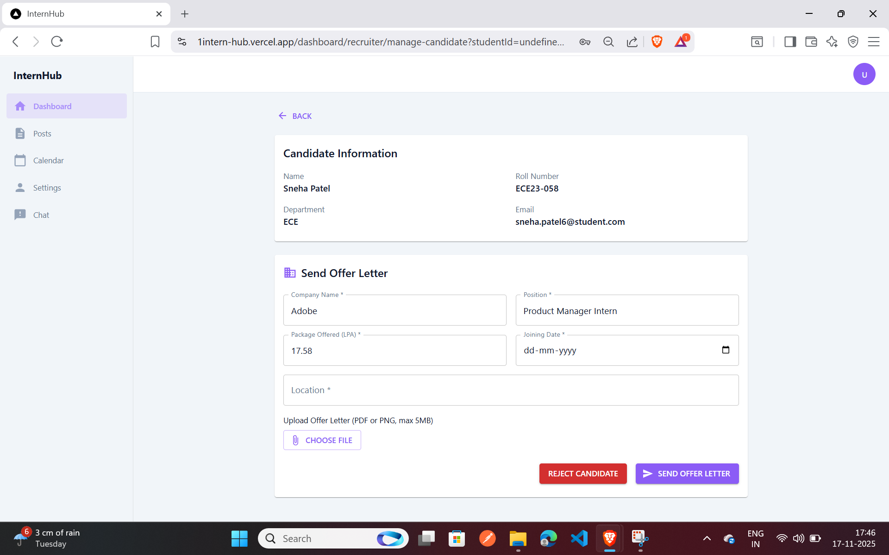
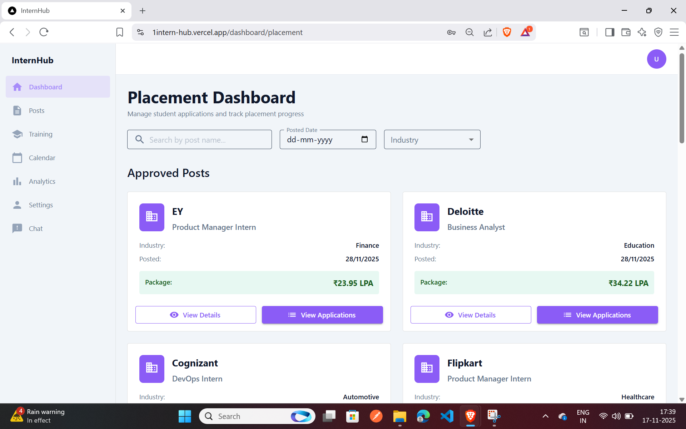
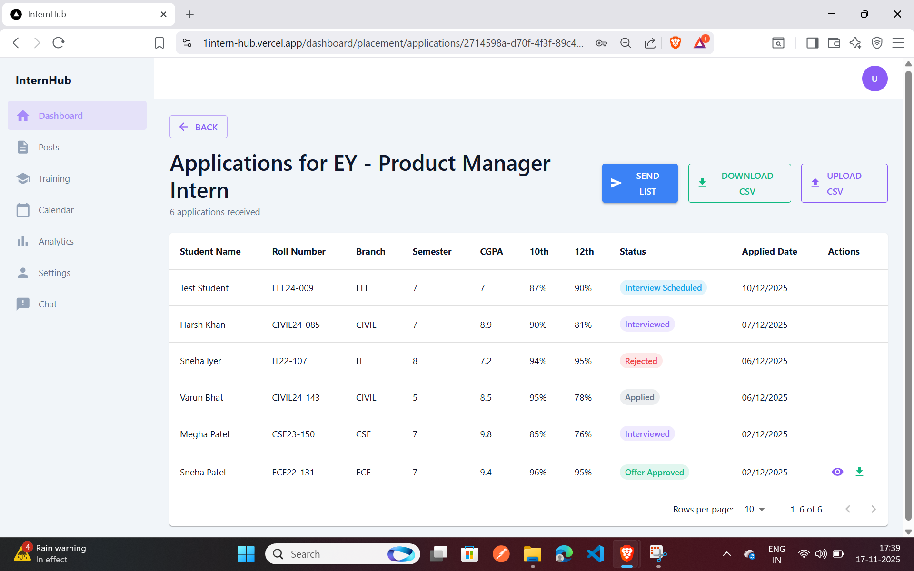
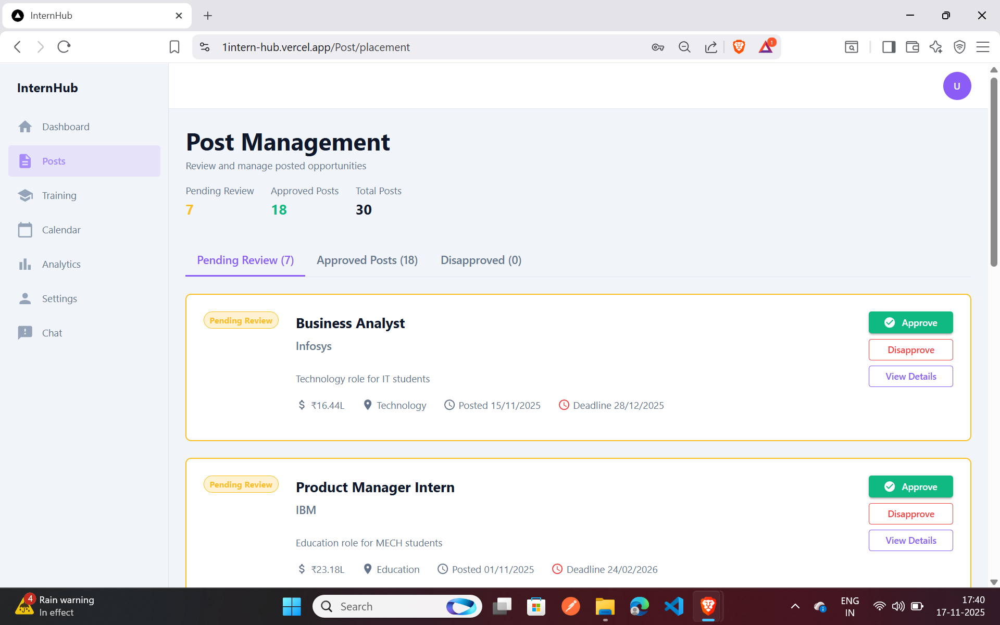

# 🚀 InternHub

### Campus Placements & Internship Management Platform

*A comprehensive platform to streamline internship and placement processes for students, recruiters, and institutions*

[**View Live Demo →**](https://1intern-hub.vercel.app)

---

## 📖 About The Project

InternHub is a modern web application designed to simplify and centralize the campus placement and internship process. It connects students seeking opportunities with recruiters looking for talent, while providing institutions with tools to manage and oversee the entire placement lifecycle.

The platform eliminates the fragmentation of traditional placement processes by bringing together job postings, applications, profile management, and communication in one unified interface.

---

## ✨ Key Features

### For Students
- **Digital Profiles**: Create comprehensive profiles showcasing education, skills, projects, and experience
- **Job Discovery**: Browse and search through available internship and placement opportunities
- **Easy Applications**: Apply to multiple positions with a single click
- **Application Tracking**: Monitor the status of all applications in real-time
- **Document Management**: Upload and manage resumes, certificates, and other documents
- **Notifications**: Receive updates on application status and new opportunities

  
  
  

---

### For Recruiters
- **Job Posting**: Create and manage multiple job listings with detailed requirements
- **Candidate Discovery**: Search and filter through student profiles based on specific criteria
- **Application Management**: Review, shortlist, and manage incoming applications efficiently
- **Communication Tools**: Connect with candidates directly through the platform
- **Analytics**: Track job posting performance and recruitment metrics

  
  
  

---

### For Placement Cell
- **Centralized Management**: Oversee all placement activities from a single dashboard
- **Student Tracking**: Monitor student participation and placement outcomes
- **Company Relations**: Manage relationships with recruiting organizations
- **Reports & Analytics**: Generate comprehensive placement reports and statistics
- **Verification**: Verify student credentials and maintain data integrity

  
  
  

---

## 🛠️ Tech Stack

---

## 🎯 Core Functionality

### User Authentication
- Secure registration and login system
- Role-based access control (Student, Recruiter, Admin)
- JWT-based authentication
- Password encryption and security

### Profile Management
- Comprehensive student profiles with education, skills, and experience
- Resume and document uploads
- Profile visibility controls
- Portfolio and project showcases

### Job & Application System
- Job posting creation with detailed descriptions
- Advanced search and filtering capabilities
- One-click application process
- Application status tracking (Applied, Under Review, Shortlisted, Rejected, Accepted)
- Automated notifications for status updates

### Search & Discovery
- Filter jobs by type, location, company, and skills
- Sort by relevance, date, and other parameters
- Save and bookmark favorite opportunities
- Personalized job recommendations

### Communication
- In-platform messaging between students and recruiters
- Interview scheduling capabilities
- Email notifications for important updates
- Application status change alerts

### Analytics & Reporting
- Student application success metrics
- Recruiter job posting performance
- Institution-wide placement statistics
- Data visualization and insights

---

## 📱 User Roles

### Students
Students can create profiles, search for opportunities, submit applications, track their progress, and communicate with recruiters.

### Recruiters
Recruiters can post job openings, search for candidates, review applications, manage the hiring pipeline, and communicate with applicants.

### Placement Cell
The placement cell oversees the entire platform, manages user accounts, verifies credentials, generates reports, and maintains system settings.

---

## 🔐 Security Features

- Password hashing using bcrypt
- JSON Web Token (JWT) authentication
- Protected API routes with middleware authorization
- Input validation and sanitization
- CORS configuration for secure cross-origin requests
- Environment variables for sensitive data
- MongoDB injection prevention

---

**Made by the InternHub Team**

⭐ Star this repo if you find it helpful!

